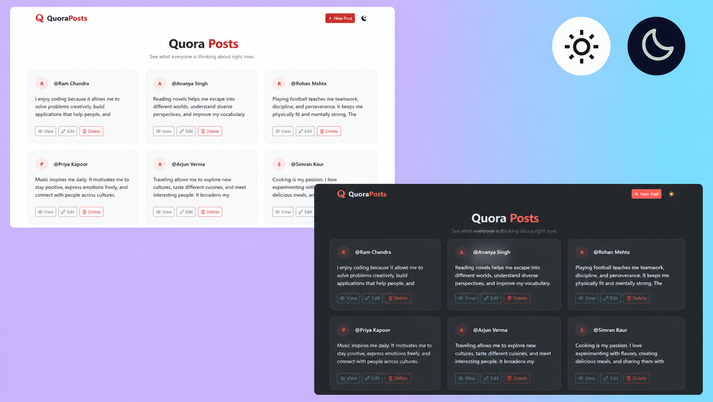

# Quora REST API CRUD

A Quora-inspired CRUD application built with **Node.js**,
**Express.js**, and **EJS** to learn RESTful APIs and server-side
rendering.

## 📸 Preview



------------------------------------------------------------------------

## ✨ Features

-   Create, Read, Update and Delete posts
-   RESTful routing
-   Server-side rendering with EJS
-   Unique IDs using UUID
-   Clean UI with HTML/CSS

------------------------------------------------------------------------

## 🛠 Tech Stack

-   Node.js
-   Express.js
-   Express
-   EJS
-   HTML5
-   CSS3
-   JavaScript
-   UUID
-   Method-Override

------------------------------------------------------------------------

## 📂 Project Structure

``` text
Quora_REST_api
├── public/
│   ├── style.css
│   └── theme.js
├── views/
│   ├── index.ejs
│   ├── new.ejs
│   ├── edit.ejs
│   ├── show.ejs
│   ├── delete.ejs
│   └── partials/
|       └── navbar.ejs
├── posts/
│   └── posts.js
├── index.js
├── package.json
├── package-lock.json
└── README.md
```

## ⚙️ Prerequisites

-   Node.js (v18+ recommended)
-   npm

## 🚀 Installation

``` bash
git clone https://github.com/code-with-vansh/Quora_REST_api.git
cd Quora_REST_api
npm install
npm start
```

Open:

``` text
http://localhost:8080/posts
```

## 🔄 Application Workflow

1.  Start the Express server.
2.  Open `/posts`.
3.  Create a new post.
4.  View individual posts.
5.  Edit existing posts.
6.  Delete posts.

Current version stores data in memory, so restarting the server resets
all posts.

## 🌐 REST Endpoints

``` text
  Method   Endpoint          Purpose
  -------- ----------------- ---------------
  GET      /posts            List posts
  GET      /posts/new        New post form
  POST     /posts            Create post
  GET      /posts/:id        View one post
  GET      /posts/:id/edit   Edit form
  PATCH    /posts/:id        Update post
  DELETE   /posts/:id        Delete post
```

## 📚 What I Learned

-   REST architecture
-   CRUD operations
-   Express routing
-   Dynamic EJS templates
-   Method Override
-   UUID usage

## 🚧 Future Improvements

-   MongoDB
-   Authentication (JWT)
-   User accounts
-   Comments & Likes
-   Image upload
-   Validation
-   Responsive UI

## 👨‍💻 Author

**Vansh Chauhan**

Learning Web Development • Backend • AI Engineering
